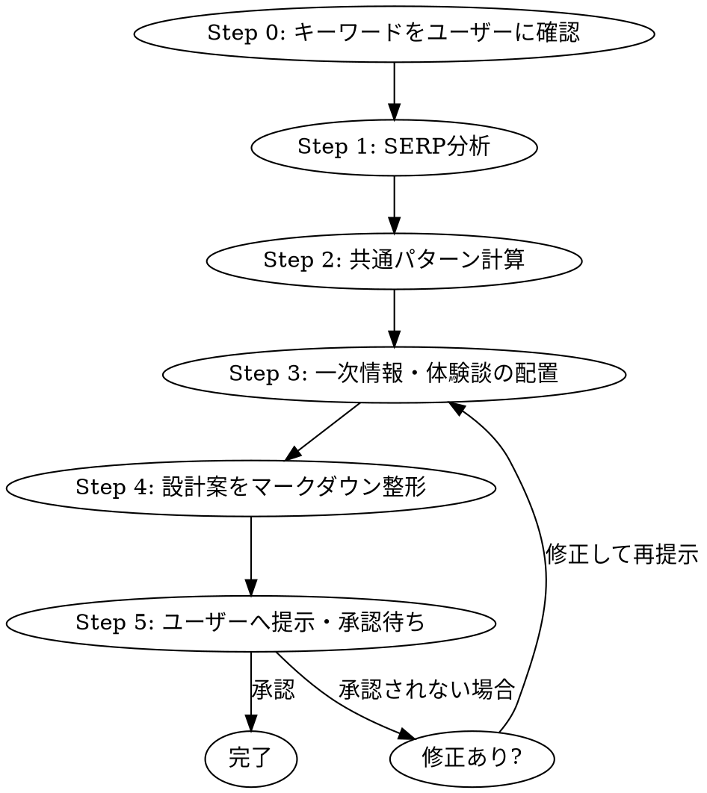

# article-design — 記事設計スキル

## 概要

**SERP分析 → 共通パターン抽出 → 設計案作成 → ユーザー承認** の順で実行する。
設計を始める前にSERPを分析しないことは、このスキルの最大の違反である。

**絶対禁止**: 自分の知識でH2構成を考えてから後付けでSERP分析をすること。

---

## 実行フロー



---

## Step 0: キーワードをユーザーに確認（最初に必ずやること）

スキル起動後、**最初にユーザーへ直接質問する**。ファイルを読んだりIDEの選択内容を参照したりしない。

```
対象キーワードを教えてください。
（例：「遺品整理 愛川町」「防音工事 綾瀬市」）
```

**禁止事項:**
- ファイルを読んでキーワードを推測する
- IDEの選択テキストからキーワードを推測する
- ユーザーの確認なしにSERP分析を開始する

ユーザーからキーワードが返ってきたら Step 1 へ進む。

---

## Step 1: SERP分析（最初に必ずやること）

Ahrefsまたはウェブ検索でSERP上位10記事のURL・DR・タイトルを取得する。
各記事をフェッチしてH2/H3見出しを抽出する。**最低7記事、目標10記事**。

出力形式:
```
【記事1】domain.jp | DR: 45
H2: 定義・意味
  H3: 背景
H2: 選び方
  H3: ポイント1
```

---

## Step 2: 共通パターン計算

全記事のH2をカテゴリ分類し、出現率を計算する。

| 判定 | 基準 | 対応 |
|------|------|------|
| 共通H2 | 出現率50%以上 | 踏襲必須（検索意図の核心） |
| 独自H2 | 出現率25%以下または0% | 差別化ポイント（一次情報で設計） |

---

## Step 3: 一次情報・体験談の配置

### 一次情報ソースの優先順位

各H2に以下の優先順位でソースを割り当てる:

1. X（旧Twitter）投稿 — 専門家の発言（投稿IDと活用方法を明記）
2. YouTube動画 — 解説動画（動画IDとタイムスタンプを明記）
3. 公式統計・行政データ — X/YTがない場合の第一代替
4. 専門家ブログ・業界団体資料
5. 実例・独自取材（筆者が一次情報化する）

**X/YouTubeがない場合に「一次情報なし」とは書かない**。3〜5のいずれかで必ず埋める。

優先順位5「独自取材」を使う場合は、取材対象（属性・地域・取材方法）を設計案に明記する。「筆者独自取材」とだけ書いて内容を空にしない。取材データがない場合は4（専門家ブログ・業界団体資料）を使う。

### 体験談H2（必須）

体験談は**専用H2として1つ独立させる**。他のH2に分散させない。

構成テンプレート:
```
H2: 実際に[サービス名]を依頼した方の体験談
  H3: 体験談①（属性・地域・状況を具体的に）
  H3: 体験談②
  H3: 体験談から分かる共通点
```

### 文字数配分

目標: **1万〜1万5000字**。各H2に文字数目安を割り当て、合計が範囲内に収まることを確認する。

---

## Step 4: 設計案をマークダウン整形

以下の表をH2ごとに作成する:

| 列 | 内容 |
|----|------|
| H2見出し | 確定テキスト |
| 共通度 | X/10サイト（XX%）|
| 一次情報ソース | 種別・ID・活用方法 |
| 文字数目安 | XX字 |

---

## Step 5: ユーザーへ提示・承認待ち（必須停止点）

以下を提示して承認を求める。承認なしにStep 6（執筆）へは進まない。

提示内容:
1. 確定H2構成の一覧
2. 共通H2 vs 独自H2の分類結果
3. 一次情報配置表
4. 推定文字数合計

**ユーザーが「OK」と明言するまでループする**。修正指示があれば反映して再提示。

---

## よくある違反と対処

| 違反 | 現実 |
|------|------|
| 「自分の知識でH2を考えてから分析する」 | SERP分析が先。知識は補完にしか使わない |
| 「X/YouTubeがないので一次情報なし」 | 行政データ・統計で代替。空欄禁止 |
| 「体験談は各H2に散らした」 | 専用H2として独立させる |
| 「設計案を提示したら承認待たずに進んだ」 | 明示的な承認まで次フェーズへ進まない |
| 「文字数は合計だけ確認した」 | H2ごとに割り当てて合計を検算する |
| 「独自取材と書いて内容を書かなかった」 | 取材対象の属性・地域・取材方法を明記する |
